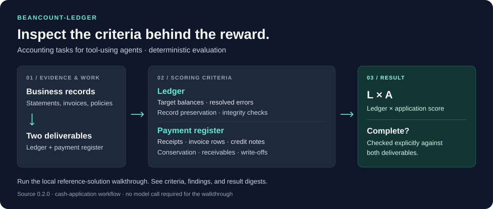

# beancount-ledger

[](https://github.com/gultekinhasancan79/beancount-ledger/actions/workflows/ci.yml) [](LICENSE) [](pyproject.toml)

> **Status.** This repository is active again as of 23 September 2026; it was archived as a reference
> snapshot from 15 to 23 September 2026. The published evidence records and the release attestation are unchanged.

**An environment for evaluating AI agents on bookkeeping and cash application, with inspectable, deterministic scoring.**

Agents read accounting evidence, repair a Beancount ledger, and, for cash-application tasks, deliver a register of payments and invoice balances. The evaluator checks the work against the task's accounting facts and reports the criteria behind the reward.

[Try the scorer](#quickstart) · [What gets checked](#what-gets-checked) · [Evaluation evidence](#evaluation-evidence) · [Technical reference](docs/REFERENCE.md)



## What gets checked

| Deliverable | Scoring criteria | Additional checks |
|---|---|---|
| Beancount ledger | Target balances reached; planted errors resolved | Preservation of existing records, damage to other accounts, fabricated or merged entries, undocumented repairs, and accounts outside the chart |
| Cash-application register | Receipt applications, closing invoice rows, and credit-note applications | Receipt conservation, closing receivables, write-offs, schema validity, and internal accounting identities |

The ledger and application components are evaluated separately. Cash-application reward is **ledger score × application score**, with completion requiring a complete ledger and an exact, delivered register without application penalties. Ledger-only tasks use the ledger score. [Scoring contracts and formulas](docs/REFERENCE.md).

## Quickstart

### Run a local scoring walkthrough

Requirements: Git, [uv](https://docs.astral.sh/uv/getting-started/installation/), and Python 3.11–3.13. The commands below select Python 3.12 and install the pinned package dependencies.

```bash
git clone https://github.com/gultekinhasancan79/beancount-ledger.git
cd beancount-ledger
uv venv --python 3.12
uv pip install -e .
uv run --no-sync python examples/scoring_walkthrough.py
```

The walkthrough executes the production scorers on the reference ledger and a register reconstructed from the task's public evidence. It prints the scoring components, findings, accounting ties, and completion result, then verifies the result digests. **No API key or model call is needed.** Installing dependencies requires network access.

This is a reference-solution walkthrough, not an agent rollout or a model-performance result. [Example output and explanation](docs/DEMO.md).

To select another authored cash-application task or inspect structured output:

```bash
uv run --no-sync python examples/scoring_walkthrough.py --task cash_application_001 --json
```

### Evaluate your model or review episodes

From the installed checkout, configure your provider's API key in an environment variable and use the pinned `vf-eval` CLI. [Model-run command and recorded examples](docs/REFERENCE.md#sample-vf-eval-runs-raw-transcripts-included).

For the local desktop app:

```bash
uv pip install -e ".[app]"
uv run --no-sync python tests/replay_webview.py
```

Live model runs use your provider account. Authored tasks need no evaluator secret; generated worlds require the [operator setup](docs/REFERENCE.md).

**Version and compatibility:** this README describes source **0.3.0**, using `verifiers==0.3.1` and its legacy **v0** workflow. It does not implement v1, and publishing it does not imply v1 support. The package uploaded to the Environments Hub as `cangultekn/beancount-ledger` is **0.2.0** (not publicly listed as of 23 September 2026), which contains no cash-application generation that can run installed; 0.3.0 is a new version and is not a rebuilt 0.2.0. [Compatibility details](docs/REFERENCE.md#compatibility-020).

## Environment coverage

| Task set | Current source coverage |
|---|---|
| Bookkeeping workflows | 91 task IDs across ten company-months |
| Clean-month assurance | Four task IDs |
| Cash application, authored | Eleven variants across four company-months |
| Cash application, generated | A released development population: 96 keyed parent groups, 192 variants, in three mechanism strata |
| Keyed bank reconciliation | Separate generated population with evaluator-controlled manifests |

The **106 authored task IDs** are public demonstrations and tests. Workflow variants share company facts, so they must be split and aggregated by world. They are not 106 independent held-out samples.

Workflows cover bank reconciliation, accounts payable, receivables, bank-feed categorization, expenses, payroll, sales tax, fixed assets, intercompany transfers, and month-end close. [Full task matrix and split rules](docs/REFERENCE.md#hand-authored-workflow-tasks).

### The generated cash-application population (new in 0.3.0)

0.3.0 distributes `cash-application-development-2` as a **released development population**. *Released* describes distribution: the generator, the population declaration and the admission battery ship in the wheel, and a package installed from that wheel can mint a declared group and serve both its variants. *Development* describes the population's experimental role, which it keeps: the frozen 60/20/20 split assignment is unchanged and **the evaluation split is not opened**.

- **96 predeclared parent groups**, 32 per mechanism stratum (fallback continuation, credit residue, advice residue), two variants each that differ in exactly one authored fact, all in the `development` split.
- **The admission rule was corrected before this population was drawn.** A credit note is bounded by the original sale it names, never by the invoice's unpaid opening balance. The correction is versioned (gate implementation 2, family preflight contract 2), and the population selected under the old rule is retired and preserved unaltered as history.
- **Census, validation, serving.** 96 admitted groups, 0 exhausted, 98 retained attempts, 0 accounting-gate refusals; 192/192 variants pass all seven offline validation gates through the shipped `candidate/1`, `application/1` and `composite/1`; 192/192 signed records serve through the real `load_environment` — [population record](reviews/cash_application_development_population_2026-09-13_replacement.md).
- **Measured from the distributed artifact.** A 0.3.0 wheel installed into a clean throwaway environment, with the repository absent from `sys.path`, mints one group per stratum and serves all six variants at reward 1.0, and the eleven authored cash tasks plus a legacy control score twelve of twelve — [installable serving check](reviews/installable_serving_check_2026-09-14/).

What this deliverable claims, stated exactly:

> A versioned, keyed cash-application generator with a frozen development population, deterministic accounting checks, golden-artifact validation and signed-manifest serving under the recorded repository runtime. No model performance, difficulty, training benefit or generalization beyond the development templates has been established.

Generated cash-application selectors are evaluator-side and need the evaluator secret and a signed family manifest. The wheel ships no goldens, no census and no provenance for generated worlds. HMAC-keyed generation protects the private generation identity against reconstruction from enumerable selectors; it does not prevent solving the accounting from the public evidence, and the family's public fold intentionally reconstructs the application register from those files.

## Evaluation evidence

- **[Fixed-panel study](reviews/arms_confirm1v4.md):** four Mistral models (three open-weight) × six generated bank-reconciliation tasks × three episode-contract arms × two replicates. Of 144 scheduled cells, 143 ran and 138 were valid. The report records the measured source revision, results, missing cells, and limitations.
- **[Cash-application screens](reviews/README.md):** three small, zero-cost screens on the authored variants and one on the generated population, each one requested model ID and one attempt per cell. The generated-population screen is **incomplete**: nine scored cells, one lost to a provider quota refusal, two unattempted, against twelve planned; seven complete successes and two application-only partials whose only defect was in-period invoices omitted from the closing register — [record](reviews/cash_application_generated_screen_2026-09-13.md). Missing outcomes are left missing, never inferred.
- **[Cold adjudication](reviews/cash_application_adjudication_2026-09-10.md):** two models of different lineages, neither a screen's subject, each shown only the public files, reconstructed the specified applications on five authored cases.
- **[Evidence index](reviews/README.md):** dated screens, scorer audits, exploit tests, and release provenance. Each historical result belongs to its recorded task and instrument version.
- **[Tests](tests/):** reference acceptance, adversarial cases, scorer behavior, and reproducibility checks, exercised by CI.

The fixed-panel study is separate from the 106 authored tasks and the local walkthrough. **No RL policy was trained in that study.** The cash-application screens do not establish population failure rates, difficulty or training utility; the accounting of the three newest company-months carries a dated AI accounting-plausibility review, not a practising accountant's sign-off, and practitioner validation remains outstanding.

## Engineering details

- **Reproducibility:** pinned dependencies, versioned episode contracts, and recorded result digests.
- **Adversarial checks:** hand-written attacks, generated constructions, an independent exploit oracle, and rotating nightly sweeps.
- **Generation boundary:** HMAC-keyed generation identity; each task remains solvable from its public accounting evidence.
- **Package boundary:** evidence archives, test fixtures, and the local walkthrough stay in the repository rather than the Hub package.

[Technical reference](docs/REFERENCE.md) · [Release attestation](reviews/RELEASE_ATTESTATION.md)

## Try it and report what you find

If you evaluate accounting agents or build task graders, start with the local walkthrough. Useful feedback includes an unclear input, a scorer disagreement, or a reproducible model failure. [Open an issue](https://github.com/gultekinhasancan79/beancount-ledger/issues) with the task ID, source commit, reproduction steps, and expected versus actual result.

[Contribution guide](CONTRIBUTING.md) · [Report a bug or give evaluation feedback](https://github.com/gultekinhasancan79/beancount-ledger/issues/new/choose)

Built by [Hasancan Gültekin](https://github.com/gultekinhasancan79) on [Prime Intellect's verifiers](https://github.com/PrimeIntellect-ai/verifiers). [Email](mailto:gultekinhasancan79@gmail.com) · [LinkedIn](https://linkedin.com/in/can79).
